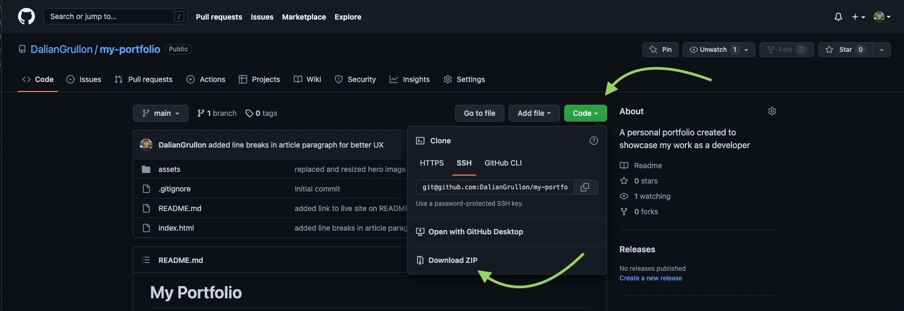

# JATE Text Editor


<br>

## Description

JATE text editor is a full stack web application and progressive web application that allows users to practice code and save their changes. Because it is a progressive web app, users can also download the web app locally and save offline changes.

<br>

## Table of Contents

- [Installation](#installation)
- [Usage](#usage)
- [Technology](#technology)
- [License](#license)

<br>

## Installation




3. Once unzipped, ensure that MongoDB is installed and connected

5. Run the following commands to  install all dependencies, seed the database, and start the application

```
npm install

npm run seed

npm start
```

<br>

## Usage

Social Network API can be used as the foundation for a social media web application. Below is a link to a live demo on how to actually run the application and test its routes using Insomnia

[Live Demo of App](https://drive.google.com/file/d/1Dg0dD5vdd4wLzuHKDhS4k_bewWR3buQ3/view?usp=sharing)

<br>

## Technology
Listed below is all of the technology I used for this project:
- Node.js
- Express.js
- MongoDB via Mongoose ODM
- Moment

<br>

## License

    Copyright © 2022 Dalian Grullon

    Permission to use, copy, modify, and/or distribute this software for any purpose with or without fee is hereby granted, provided that the above copyright notice and this permission notice appear in all copies.

    THE SOFTWARE IS PROVIDED "AS IS" AND THE AUTHOR DISCLAIMS ALL WARRANTIES WITH REGARD TO THIS SOFTWARE INCLUDING ALL IMPLIED WARRANTIES OF MERCHANTABILITY AND FITNESS. IN NO EVENT SHALL THE AUTHOR BE LIABLE FOR ANY SPECIAL, DIRECT, INDIRECT, OR CONSEQUENTIAL DAMAGES OR ANY DAMAGES WHATSOEVER RESULTING FROM LOSS OF USE, DATA OR PROFITS, WHETHER IN AN ACTION OF CONTRACT, NEGLIGENCE OR OTHER TORTIOUS ACTION, ARISING OUT OF OR IN CONNECTION WITH THE USE OR PERFORMANCE OF THIS SOFTWARE.