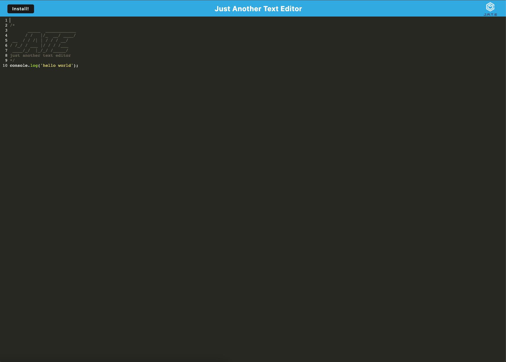

# JATE Text Editor


<br>

## Description

JATE text editor is a full stack web application and progressive web application that allows users to practice code and save their changes. Because it is a progressive web app, users can also download the web app locally and save offline changes.

[Live Application](https://salty-dusk-14160.herokuapp.com/)

<br>

## Table of Contents

- [Installation](#installation)
- [Usage](#usage)
- [Technology](#technology)
- [License](#license)

<br>

## Installation


3. Once unzipped, run the following commands to  install all dependencies and start the application

```
npm install

npm start
```

<br>

## Usage

JATE text editor allows users to save code snippets and download the web application locally, allowing for offline changes,

JATE is a single page web app. All changes can be done in the code editor on landing page. You can locally install the application via the "Install" button in the top right of the screen.

 

<br>

## Technology
Listed below is all of the technology I used for this project:
- Node.js
- Express.js
- Webpack
- Babel

<br>

## License

    Copyright © 2022 Dalian Grullon

    Permission to use, copy, modify, and/or distribute this software for any purpose with or without fee is hereby granted, provided that the above copyright notice and this permission notice appear in all copies.

    THE SOFTWARE IS PROVIDED "AS IS" AND THE AUTHOR DISCLAIMS ALL WARRANTIES WITH REGARD TO THIS SOFTWARE INCLUDING ALL IMPLIED WARRANTIES OF MERCHANTABILITY AND FITNESS. IN NO EVENT SHALL THE AUTHOR BE LIABLE FOR ANY SPECIAL, DIRECT, INDIRECT, OR CONSEQUENTIAL DAMAGES OR ANY DAMAGES WHATSOEVER RESULTING FROM LOSS OF USE, DATA OR PROFITS, WHETHER IN AN ACTION OF CONTRACT, NEGLIGENCE OR OTHER TORTIOUS ACTION, ARISING OUT OF OR IN CONNECTION WITH THE USE OR PERFORMANCE OF THIS SOFTWARE.